
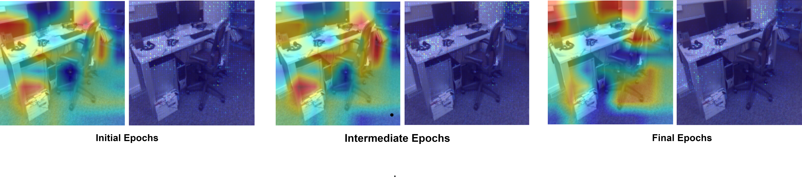
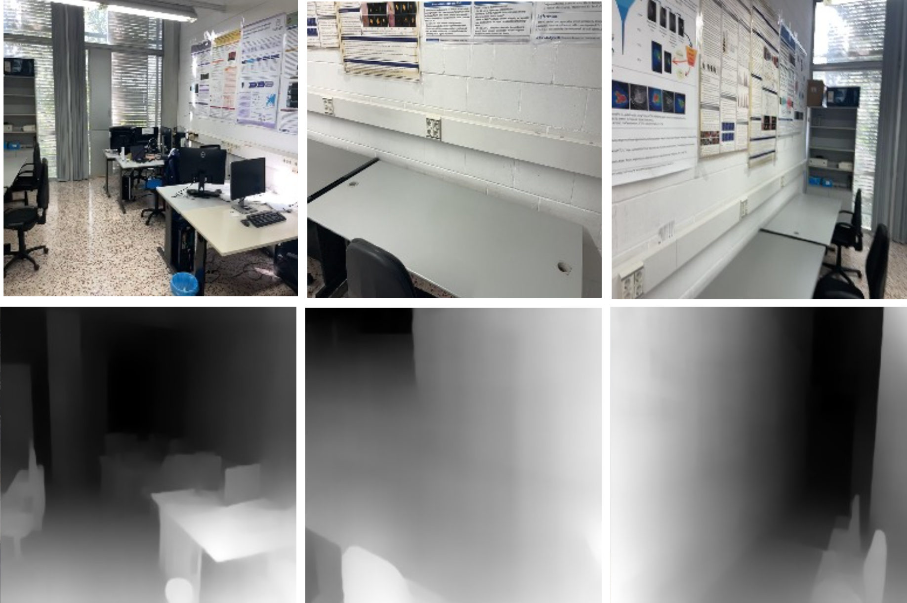

<div align="center">

# Mobile-CoHAtNet

### A Lightweight Multimodal CNN–Transformer for Efficient Camera Localization from RGB-D and IMU Data

[Hussein Hasan](https://orcid.org/0009-0002-8486-0771)<sup>1</sup>, Miguel Angel Garcia<sup>2</sup>, Hatem Rashwan<sup>1</sup>, Domenec Puig<sup>1</sup>

<sup>1</sup> University Rovira i Virgili, Tarragona, Spain &nbsp;&nbsp; <sup>2</sup> Autonomous University of Madrid, Madrid, Spain

*Machine Vision and Applications* 37, 171 (2026)

[](https://link.springer.com/article/10.1007/s00138-026-01935-5)
[](https://doi.org/10.1007/s00138-026-01935-5)
[](https://drive.google.com/drive/folders/1DRH1vohn71Mv8_6adYFZVhAspAv2nuRF?usp=sharing)

</div>

---

## Overview

Camera localization, i.e. recovering a camera's 6-DoF pose in 3D space, is a key building block of AR/VR, autonomous navigation and robotics. Existing learning-based localizers struggle to be both accurate and efficient: convolutional networks are fast and good at local geometry but miss the global picture, Transformers see the whole scene but are expensive to run, and a single RGB camera cannot resolve metric scale on its own, which limits pose precision.

**Mobile-CoHAtNet** is a multimodal hybrid CNN–Transformer built with efficiency as the first priority. With only **4.23 M parameters (16.9 MB)**, it combines RGB, depth and inertial (IMU) data in one compact network through three design choices:

- **Geometry-aware hybrid attention:** MBConv features are injected into the *Value* branch of self-attention, so local and global reasoning happen inside the same lightweight block.
- **Unified RGB-D backbone:** a single backbone processes colour and depth together, replacing the usual dual-encoder design and its redundant feature extractors.
- **Lightweight late IMU fusion:** a small inertial module refines the pose estimate at negligible extra cost.

On **7-Scenes** and **Cambridge Landmarks**, Mobile-CoHAtNet performs on par with recent state-of-the-art methods, and better in several cases, despite being much smaller, and it runs at **73.5 FPS on an off-the-shelf smartphone**. Real-world experiments with smartphone RGB-D frames and measured IMU signals further show that it stays robust under difficult visual and geometric conditions. The takeaway: a large backbone is not a prerequisite for competitive 6-DoF pose regression, and a design built around efficiency can run on resource-limited hardware.

## Architecture

<p align="center">
  
</p>
<p align="center"><em>Architecture of Mobile-CoHAtNet.</em></p>

The full model implementation is provided in [`Mobile-CoHAtNet.py`](Mobile-CoHAtNet.py).

## Attention Visualization

<p align="center">
  
</p>
<p align="center"><em>Attention heatmaps of Mobile-CoHAtNet.</em></p>

## Self-Collected Mobile Dataset

For the real-world evaluation, we recorded a laboratory sequence with an off-the-shelf **iPhone 14 Pro Max** using the [Stray Scanner](https://github.com/strayrobots/scanner) app. The sequence contains synchronized RGB frames, LiDAR depth and real IMU measurements, and the scene includes cluttered areas, texture-less surfaces and repetitive patterns that make localization challenging.

📁 **Download:** [Google Drive](https://drive.google.com/drive/folders/1DRH1vohn71Mv8_6adYFZVhAspAv2nuRF?usp=sharing)

<p align="center">
  
</p>
<p align="center"><em>Sample from the self-collected mobile dataset.</em></p>

## Citation

If you find this work useful, please cite:

> Hasan, H., Garcia, M.A., Rashwan, H. *et al.* Mobile-CoHAtNet: a lightweight multimodal CNN–transformer for efficient camera localization from RGB-D and IMU data. *Machine Vision and Applications* **37**, 171 (2026). https://doi.org/10.1007/s00138-026-01935-5

```bibtex
@article{hasan2026mobilecohatnet,
  author    = {Hasan, Hussein and Garcia, Miguel Angel and Rashwan, Hatem and Puig, Domenec},
  title     = {{Mobile-CoHAtNet}: a lightweight multimodal {CNN}--transformer for efficient camera localization from {RGB-D} and {IMU} data},
  journal   = {Machine Vision and Applications},
  volume    = {37},
  number    = {6},
  pages     = {171},
  year      = {2026},
  publisher = {Springer},
  doi       = {10.1007/s00138-026-01935-5},
  url       = {https://doi.org/10.1007/s00138-026-01935-5}
}
```
